# NEXO

Laboratorio local de agentes cognitivos. Dos personajes, **Nexus** y **Nira**, viven en tu máquina: aprenden de forma distinta, deciden por su cuenta dentro de un simulacro, y pueden conectarse a nodos voluntarios (otro proceso en el PC, o una app Android) sin convertir el material remoto en conocimiento verificado.

| | |
|--|--|
| Versión | `0.3.0` |
| Python | 3.11 o superior |
| Licencia | MIT (`LICENSE`) |
| Visibilidad | Repositorio **público**. El historial de este repositorio empieza en el árbol publicable; no arrastra estados ni PDF de un laboratorio local. |
| Qué no afirma | No es consciencia, no es AGI, no es un servicio en la nube, no es diagnóstico psicológico. |

Cuarenta segundos de un arranque real: la central 3D, las dos ramas en pixel art y el hub que solo las enlaza.

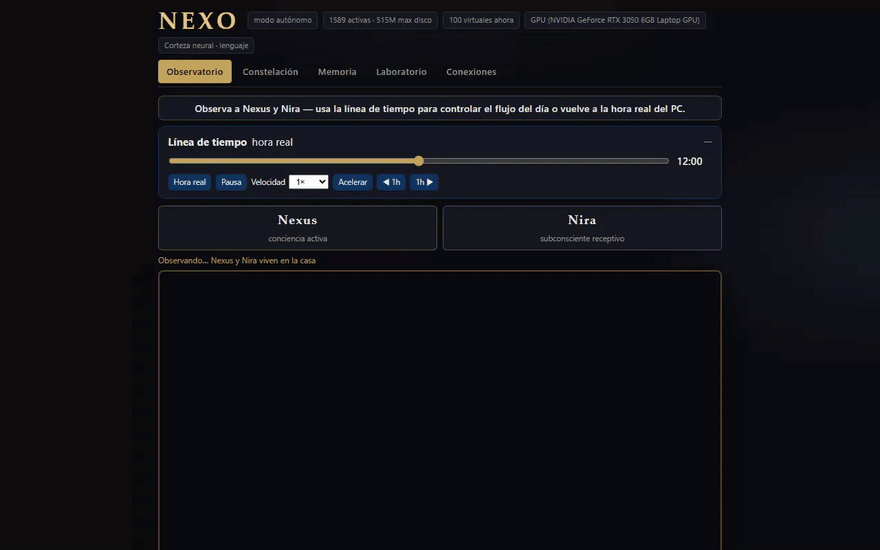

---

## Qué tiene de único

La mayoría de los laboratorios de agentes son un solo modelo con un prompt y una memoria. NEXO separa cosas que normalmente se mezclan.

1. **Dos mentes con el mismo derecho a iniciar, y ciclos distintos.** Nexus aprende en activo (propone, actúa con permiso, evalúa). Nira aprende en receptivo (observa, asocia, consolida, y solo entonces plantea una hipótesis que se puede verificar). Nira no es un asistente del otro.

2. **Una asociación no se convierte sola en un hecho.** Cada registro de aprendizaje tiene un tipo: observación, recuerdo, inferencia, asociación simbólica, hipótesis o resultado verificado. Las asociaciones simbólicas quedan trazadas a la experiencia que las originó y no se promueven a conocimiento verificado sin una comprobación aparte.

3. **Tres planos que no se sustituyen.** La decisión del personaje (aceptar, rechazar, negociar, posponer, pedir información o descansar), la autorización de quien usa el laboratorio, y si el dispositivo está realmente disponible. Un rechazo del personaje no desconecta el nodo. Una relación cordial no vuelve verdadera una afirmación falsa.

4. **La relación no es un número de amistad.** Afinidad, confianza por ámbito, historial de cooperación, desacuerdos pendientes, reparación, reciprocidad y límites de intercambio son ejes independientes.

5. **El enjambre es opt-in y local.** El núcleo científico (`nexo/` + `nexo_qa/`) sigue siendo determinista y reproducible. Los nodos, el hub de presencia y el gateway móvil no reescriben ese núcleo. El material que llega de fuera entra en cuarentena hasta una promoción explícita.

6. **Los arquetipos cambian la decisión, no solo el vocabulario.** Doce presets de diseño, inspirados en Jung, sesgan si un personaje acepta, pide más datos o descansa. No son una tipología clínica ni un horóscopo.

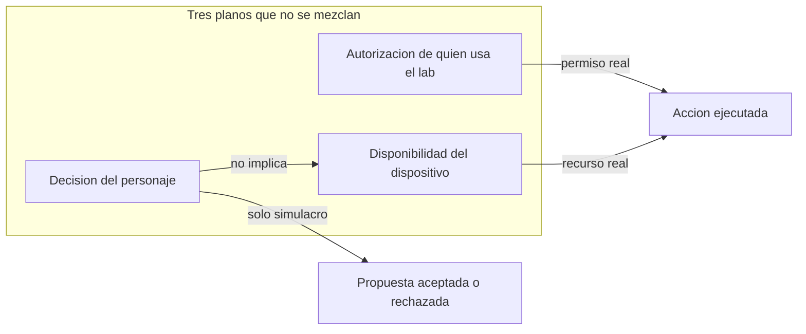

---

## Qué es y qué no es

**Es** un laboratorio que corre en loopback: un observatorio web, un mundo 2D/3D, memoria con procedencia, y un enjambre opcional de nodos.

**No es** un producto alojado, una mente demostrada, ni un canal para redistribuir libros de terceros. Los PDF de estudio, si los usas, viven solo en tu disco bajo `data/library/` y no forman parte del repositorio.

---

## Los dos personajes

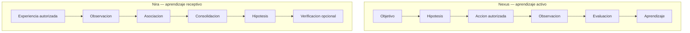

| | Nexus | Nira |
|--|--|--|
| Alias | `nexus`, `nexo` | `nira` |
| Metáfora de laboratorio | Consciencia funcional activa | Subconsciente funcional receptivo |
| Arquetipo de diseño | Sí-mismo (`self`) | Ánima (`anima`) |
| Iniciativa | Investiga y propone | También propone. No es subordinada. |
| Memoria del otro | Sin acceso irrestricto a la memoria privada del otro | Igual |

Código: `brain/dyad_learning.py`, `brain/character_autonomy.py`, `brain/relationship_model.py`, `brain/personality_archetypes.py`.

### Tipos de registro

| Tipo | Qué significa |
|--|--|
| Observación | Algo percibido en el mundo o en una fuente autorizada |
| Recuerdo | Experiencia guardada con procedencia |
| Inferencia | Conclusión marcada como tal |
| Asociación simbólica | Vínculo trazable. No es un hecho |
| Hipótesis | Afirmación pendiente de comprobación |
| Resultado verificado | Solo entra con evidencia, no por repetición ni por afinidad |

El material remoto se etiqueta en cuarentena (`untrusted`) hasta que alguien lo promueve a propósito.

---

## Mapa del programa

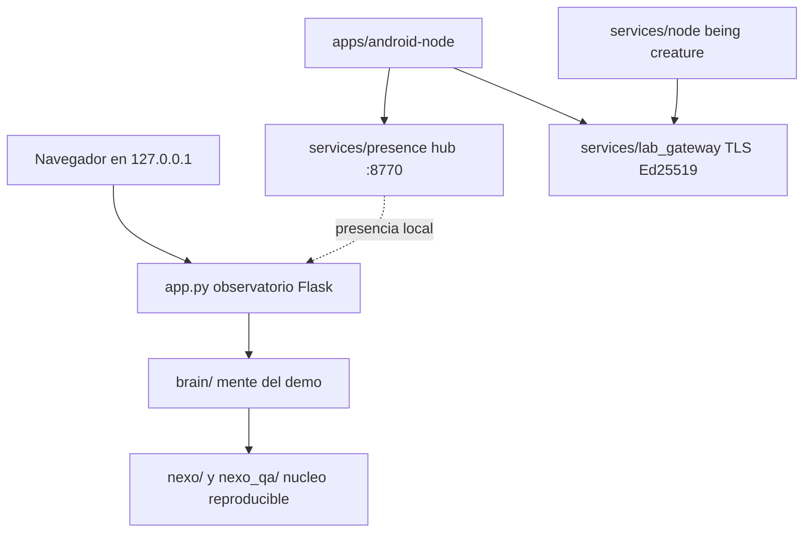

| Ruta | Para qué sirve |
|--|--|
| `app.py`, `templates/`, `static/` | Observatorio. Escena, chat y cinco secciones: Observatorio, Constelación, Memoria, Laboratorio, Conexiones |
| `brain/` | Memoria, sueño, lenguaje, díada, arquetipos, cartas de símbolo, relaciones |
| `nexo/`, `nexo_qa/` | Núcleo determinista y batería de QA cognitiva. El enjambre no lo sustituye |
| `services/presence/` | Hub visual local. Ramas y Android anuncian presencia |
| `services/lab_gateway/` | Emparejamiento, sobres firmados, nonce contra reenvío, cuarentena |
| `services/node/`, `services/being/`, `services/creature/` | Nodo voluntario, identidad y criatura. Incluye STOP |
| `protocols/mobile/`, `protocols/lif/` | Contratos del móvil y del slice LIF |
| `apps/android-node/` | App Kotlin (actividades Cerebro y Nodo). Gradle wrapper incluido |
| `tests/` | Regresión, hardening, presencia, embeddings, contratos |
| `scripts/` | Humo de díada, gateway, artefacto de release |
| `docs/` | Arquitectura, seguridad, instalación, móvil |

El observatorio lee APIs reales: `/api/dyad/learning`, `/api/personalities`, `/api/autonomy/decisions`, `/api/relationships`, `/api/connections/hub`. Si no hay hub, la sección de conexiones se muestra vacía. No inventa dispositivos.

---

## Así se ve

Las mismas pantallas del recorrido, quietas, para leerlas. Estado de demostración: no es el archivo de recuerdos de quien ejecuta el laboratorio. El campo del token, en Android, va vacío.

### Central

El observatorio 3D es la central. Nexus y Nira comparten la casa. La línea de tiempo acelera o pausa el día.

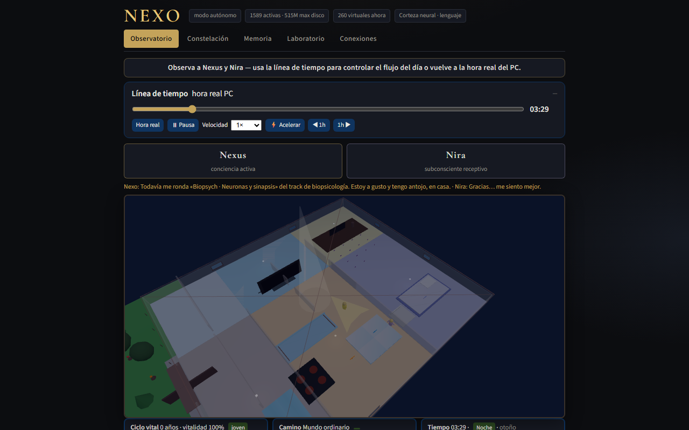

Constelación muestra arquetipos, el vínculo y las decisiones de autonomía. Memoria separa el aprendizaje diádico del estudio nocturno. Laboratorio expone cuerpo, codec y decisión causal.

| Constelación | Memoria | Laboratorio |
|--|--|--|
| 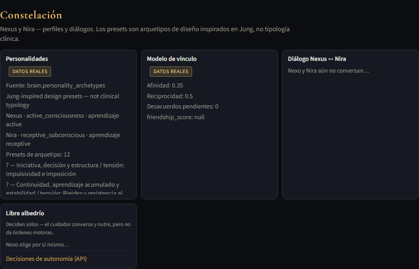 | 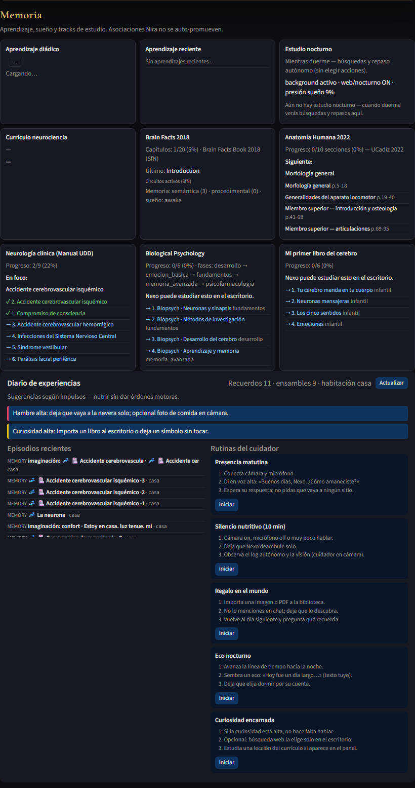 | 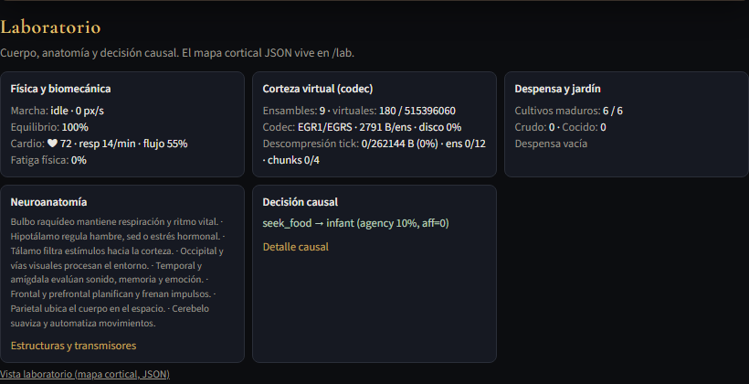 |

Conexiones habla con el hub real en el puerto 8770. Si el hub no responde, lo dice. No rellena dispositivos.

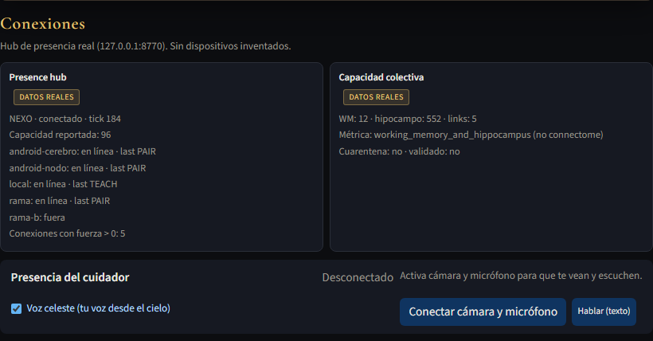

### Ramas

`http://127.0.0.1:8770/` no redibuja la central. Apunta al observatorio y a dos ramificaciones en pixel art. Cada rama saluda, observa y enseña por su cuenta. El cruce con un nodo Android, cuando hay uno, aparece como texto de lo que se enseñaron, no como un marcador inventado.

| Primera rama | Segunda rama |
|--|--|
| 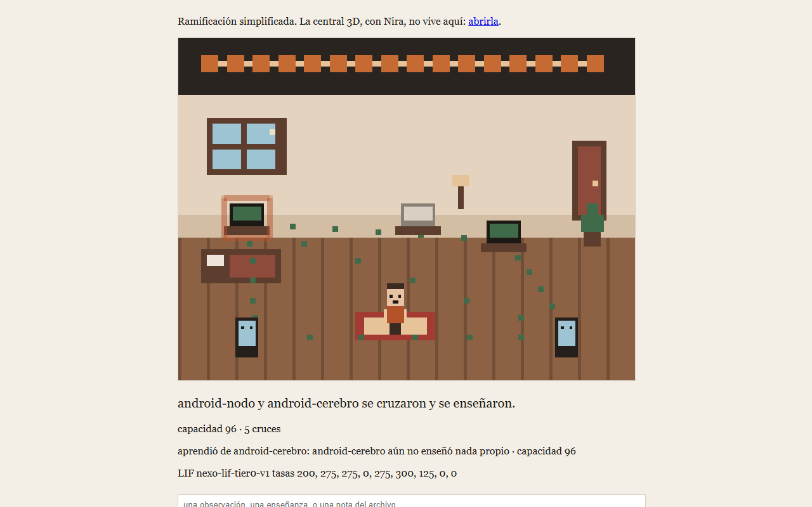 | 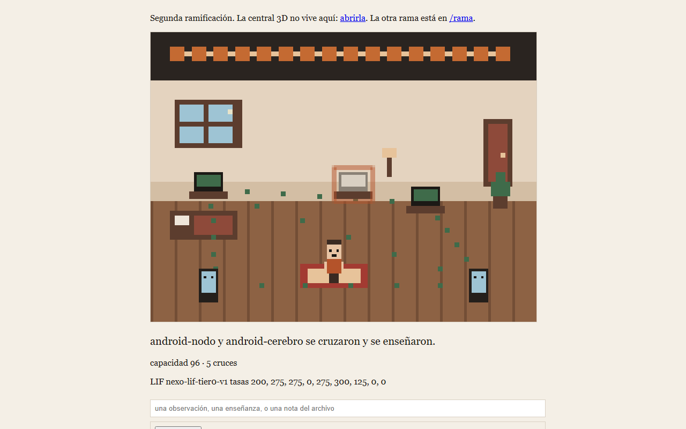 |

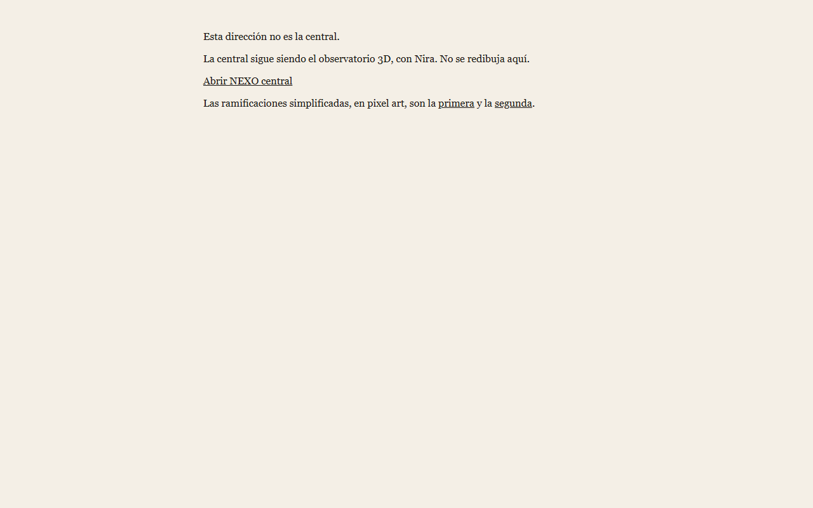

### Android

Dos actividades en el mismo APK. El campo del token se muestra vacío: el valor se queda en el teléfono, no en el repositorio. La casa de pixel art es la misma escena que la rama, vista desde el nodo.

| Cerebro | Nodo |
|--|--|
| 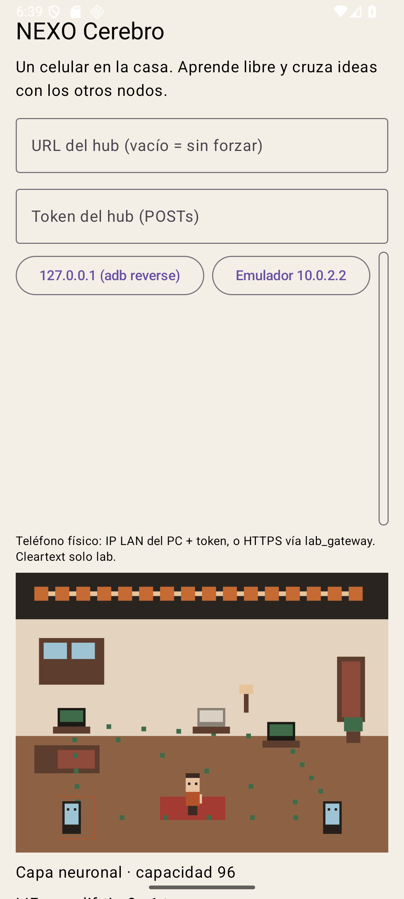 |  |

---

## Arquetipos y cartas de símbolo

Doce presets en `brain/personality_archetypes.py`. Cambian puntuaciones de `decide()` (aceptar, rechazar, negociar, posponer, pedir información, descansar).

| Clave | Nombre | Clave | Nombre |
|--|--|--|--|
| `hero` | El Héroe | `everyman` | El Ciudadano |
| `innocent` | El Inocente | `magician` | El Mago |
| `lover` | El Amante | `explorer` | El Explorador |
| `caregiver` | El Cuidador | `ruler` | El Soberano |
| `creator` | El Creador | `outlaw` | El Rebelde |
| `sage` | El Sabio | `mystic` | El Introspectivo |

Nexus usa el perfil Self. Nira usa el perfil Ánima. Por defecto, al evaluar una propuesta, Nexus parte del arquetipo `outlaw` y Nira del `mystic` (`brain/character_autonomy.py`). Eso es un sesgo de diseño, no un diagnóstico.

El demo reparte además **22 cartas de símbolo** (`brain/archetype_cards.py`): sombra, ánima, sí-mismo, trickster, individuación, renacimiento y otras figuras del mismo vocabulario. Si la curiosidad supera un umbral, el personaje puede acercarse, tocar la carta y guardarla como recuerdo. No es adivinación. `POST /api/archetype-cards/draw` responde 403: las cartas no se reparten por comando externo.

Detalle: [`docs/NEXO_PERSONALITIES.md`](docs/NEXO_PERSONALITIES.md), [`docs/NEXO_LEARNING_AUTONOMY.md`](docs/NEXO_LEARNING_AUTONOMY.md).

---

## Requisitos

- Python 3.11 o superior
- Windows 10/11, Linux o macOS
- Un navegador moderno para el observatorio
- Opcional: Docker 24+ para la imagen de validación (`docs/DOCKER_VALIDATION.md`)
- Opcional, solo si vas a compilar la app: JDK 17 o el JBR 21 de Android Studio, Android SDK platform 35
- Opcional: Ollama o CUDA. El núcleo no los necesita

---

## Instalación

Estas órdenes bastan para levantar el observatorio en una máquina limpia. No hace falta cuenta, token ni archivo de secretos.

### 1. Clonar y crear un entorno

```bash
git clone https://github.com/FernandoLizana/nexo-cerebro.git
cd nexo-cerebro
python -m venv .venv
```

Activar el entorno:

```bash
# Windows (PowerShell)
.\.venv\Scripts\Activate.ps1

# Linux y macOS
source .venv/bin/activate
```

### 2. Instalar

```bash
python -m pip install --upgrade pip
python -m pip install -e ".[dev]"
python -c "import nexo, brain; print('ok')"
```

`pip install -e .` (sin extras) alcanza para ejecutar el observatorio. El extra `dev` añade pytest, cobertura y timeout, y es el que usa la integración continua.

| Extra | Cuándo |
|--|--|
| `.[dev]` | Correr la suite y desarrollar |
| `.[browser]` | Pruebas de BrowserWorld. Después: `python -m playwright install chromium` |
| `.[gpu]` | CuPy. Rutas GPU antiguas. No hace falta para el observatorio |

### 3. Abrir el observatorio

```bash
python app.py
```

Abre [http://127.0.0.1:5000/](http://127.0.0.1:5000/). El proceso escucha solo en loopback. El puerto se cambia con la variable `CEREBRO_PORT`.

La primera ejecución crea estado local bajo `data/brain_state/`. Ese directorio es tuyo, está en `.gitignore` y no se sube al repositorio. Borrarlo reinicia la memoria del demo. No lo borres si quieres conservar lo que el laboratorio ya guardó.

---

## Arranque del enjambre local

Todo esto es opcional. El observatorio funciona sin hub y sin Android.

### Hub de presencia

```bash
python -m services.presence.hub
```

Queda en [http://127.0.0.1:8770/](http://127.0.0.1:8770/). Si no defines `NEXO_PRESENCE_TOKEN`, el proceso crea un token en `data/presence_hub/token.txt`. Ese archivo es local, está ignorado por git y no debe copiarse a issues, logs públicos ni capturas. Las peticiones que modifican estado exigen la cabecera `X-Nexo-Presence-Token` y un `Host` de loopback (el emulador de Android puede usar el alias de laboratorio `10.0.2.2`).

### Nodo de escritorio

```bash
nexo-node start --name lab-a --cpu-max 40 --ram-max-mb 1024
```

Otros comandos instalados con el paquete: `nexo-being`, `nexo-creature`, `nexo-dashboard`, `nexo-lab`, `nexo-lab-gateway`, `nexo-verify`. El panel `nexo-dashboard` también es solo loopback y guarda su token en `data/nexo_dashboard/`, fuera de git.

### Gateway de laboratorio

El gateway móvil está apagado por defecto. El humo que no abre la red es:

```bash
python scripts/smoke_lab_gateway.py
```

El arranque con emparejamiento real, flags de riesgo y TLS está en [`docs/NEXO_INSTALL.md`](docs/NEXO_INSTALL.md) y [`docs/MOBILE_PAIRING.md`](docs/MOBILE_PAIRING.md). No pegues claves ni tokens en la línea de órdenes de un documento: pásalos por variable de entorno o por el archivo local ignorado.

### Android (depuración)

Hace falta el SDK. Crea `apps/android-node/local.properties` con `sdk.dir` apuntando a tu instalación. Ese archivo no se versiona.

```bash
cd apps/android-node
gradlew.bat :app:assembleDebug
adb reverse tcp:8770 tcp:8770
adb install -r app/build/outputs/apk/debug/app-debug.apk
```

En Linux y macOS el wrapper es `./gradlew`. Para un saludo automático de laboratorio, el intent acepta `hub_url`, `presence_token` y `auto_greet`. El valor del token sale de tu `token.txt` local. No lo escribas en el repositorio.

---

## Cómo se mueve una decisión

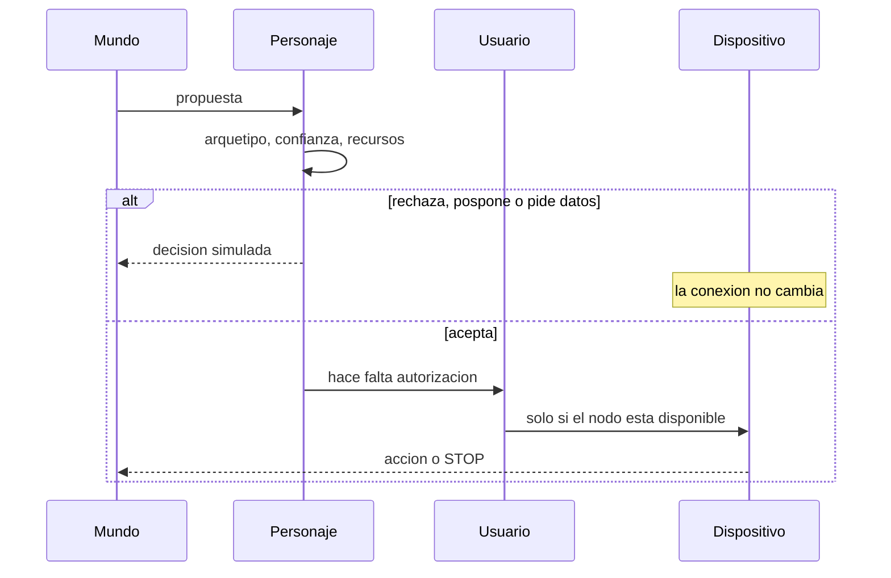

STOP es cooperativo: el trabajo en curso deja de escribir éxito después de cancelarse. En Android, la acción de parada del servicio en primer plano corta el trabajo asociado.

---

## Seguridad, en corto

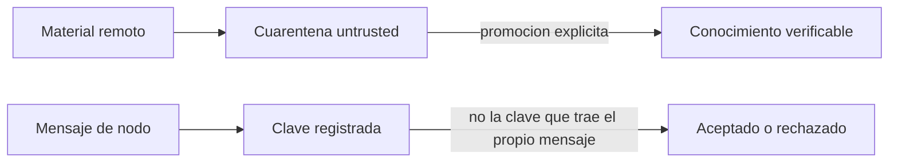

- La firma de un nodo se comprueba contra la clave **registrada**, no contra una clave que viaje dentro del mensaje.
- BrowserWorld solo navega orígenes de una lista por esquema, host y puerto. Un prefijo parecido no cuela.
- Identificadores de ser y de memoria no pueden salir de su directorio.
- Los embeddings no se comparan si las dimensiones no coinciden. La caché usa el hash del texto completo.
- El artefacto de release (`scripts/build_release_artifact.py`) excluye `data/library/`, estados de ejecución, certificados y `token.txt`, y falla si el ZIP contiene un secreto o un PDF.

Detalle: [`docs/NEXO_SECURITY.md`](docs/NEXO_SECURITY.md) y [`SECURITY.md`](SECURITY.md).

### Qué no debe estar en git

| Generado en tu máquina | Dónde queda |
|--|--|
| Token del hub de presencia | `data/presence_hub/token.txt` o `NEXO_PRESENCE_TOKEN` |
| Token del panel | `data/nexo_dashboard/` |
| Estado y recuerdos del demo | `data/brain_state/` |
| PDF de estudio de terceros | `data/library/` |
| Claves, certificados, keystores | `*.pem`, `*.key`, `*.keystore` |
| SDK de Android | `apps/android-node/local.properties` |

Este repositorio no incluye tokens, estados de ejecución ni PDF de terceros. Si generas un token en tu máquina, no lo subas.

---

## Comprobar que la instalación sirve

```bash
python scripts/proof_dyad_autonomy.py
python -m pytest tests/test_nexo_hardening.py tests/test_embeddings_compat.py tests/test_node_stop.py tests/test_relationship_model.py tests/test_observatory_api.py tests/test_presence_four.py -q
```

La suite completa, la misma que corre la integración continua:

```bash
python -m pytest tests/ -q
```

Las pruebas de navegador necesitan el extra `browser` y Chromium instalado con Playwright. Sin eso, esos archivos fallan porque no hay navegador, no porque el núcleo esté roto. El flujo de GitHub está en `.github/workflows/tests.yml` y ejecuta `tests/` entero, sin pasos que ignoren el fallo.

Otras comprobaciones:

```bash
python scripts/smoke_lab_gateway.py
python scripts/build_release_artifact.py
python scripts/validate_pre_release.py
```

El ZIP sale en `dist/` con `SHA256SUMS.txt`. No incluye bibliotecas PDF ni estado personal.

---

## Límites conocidos

- No hay servicio alojado ni alta de usuarios.
- El teléfono físico y un TLS de producción no forman parte del arranque por defecto. Hace falta una red y un certificado que elijas tú.
- Las cartas de símbolo y los arquetipos son mecanismos de laboratorio, no una lectura de personalidad.
- `publication_finalization/relevant_source/` es una instantánea congelada de un artículo. No es el código que debes modificar ni ejecutar.

Lista ampliada: [`KNOWN_LIMITATIONS.md`](KNOWN_LIMITATIONS.md).

---

## Documentación

| Documento | Contenido |
|--|--|
| [`docs/NEXO_ARCHITECTURE.md`](docs/NEXO_ARCHITECTURE.md) | Capas y qué es legado frente al núcleo |
| [`docs/NEXO_INSTALL.md`](docs/NEXO_INSTALL.md) | Nodo, panel, emparejamiento, parada y recuperación |
| [`docs/NEXO_SECURITY.md`](docs/NEXO_SECURITY.md) | Modelo de amenazas operativo |
| [`docs/NEXO_PERSONALITIES.md`](docs/NEXO_PERSONALITIES.md) | Los doce arquetipos |
| [`docs/NEXO_LEARNING_AUTONOMY.md`](docs/NEXO_LEARNING_AUTONOMY.md) | Díada, cuarentena y autonomía |
| [`docs/NEXO_THIRD_PARTY_CONTENT.md`](docs/NEXO_THIRD_PARTY_CONTENT.md) | Por qué los PDF no viajan en el repo |
| [`docs/MOBILE_PAIRING.md`](docs/MOBILE_PAIRING.md) | Emparejamiento Android |
| [`docs/OWNER_CHECKLIST.md`](docs/OWNER_CHECKLIST.md) | Qué no subir nunca (tokens, estado, PDF) |
| [`ARCHITECTURE.md`](ARCHITECTURE.md) | Mapa corto del núcleo Swarm |

---

## Contribuir

1. Rama de trabajo aparte de `main`.
2. No añadas `data/`, tokens, claves ni PDF.
3. `python -m pytest tests/ -q` antes del pull request.

---

## Licencia

Este software se publica bajo la [licencia MIT](LICENSE). Copyright (c) 2026 NEXO Project. Puedes usarlo, copiarlo, modificarlo y distribuirlo, incluido con fines comerciales, siempre que conserves el aviso de copyright y el texto de la licencia.

Si citas experimentos, usa la versión, el commit y el identificador de condición (`CITATION.cff`).

Úsalo en local, con consentimiento sobre los datos que le des, y sin presentar las metáforas del laboratorio como capacidades humanas demostradas.
