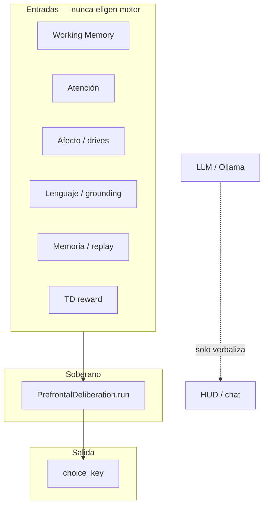

# Artefacto maestro — Roadmap 100 mejoras Nexo/cerebro

**Proyecto:** `cerebro` (Nexo — análogo cerebral funcional)  
**Fecha de cierre:** 2026-08-04  
**Principio rector:** solo `brain/deliberation.py` escribe `choice_key` (libre albedrío / agency PFC)

---

## 1. Resumen ejecutivo

Se implementó el roadmap completo de **100 mejoras** organizadas en **11 bloques (A–K)**, con módulos Python, flags de ablación, cableado en `mind.py` / `agent_loop.py`, demo Flask con todos los flags ON, tests unitarios por bloque y orquestador de batería experimental E1–E8 @10k.

| Métrica | Valor |
|---------|-------|
| Bloques implementados | A–K (100 ítems) |
| Tests dynamics (B–K) | **61 passed** (corrida 2026-08-04) |
| Perfil paper principal | `neuro-10k` (~10 290 neuronas LIF activas) |
| Perfil escala máxima | `neuro-100k` (≥95 000 neuronas) |
| GPU validada | NVIDIA GeForce RTX 3050 6 GB + CuPy CUDA 12 |
| Agency audit (item 100) | **OK** — 0 violaciones estáticas |

---

## 2. Mapa de bloques A–K

| Bloque | Ítems | Módulo(s) principal(es) | Test(s) |
|--------|-------|-------------------------|---------|
| **A** — Escala y arquitectura | 1–12 | `profile.py`, `cortical_layers.py`, `vascular.py`, `decompression_governor.py`, `inhibition.py` | `test_scale_architecture.py` |
| **B** — Ritmos y temporalidad | 13–20 | `oscillations.py`, `scn_clock.py`, `regional_latency.py`, `neuroanatomy.py` (callosum) | `test_rhythm_dynamics.py` |
| **C** — Percepción sensorial | 21–32 | `sensory_perception.py`, `vision.py`, audición/SC integrados | `test_sensory_perception.py` |
| **D** — Cognición ejecutiva | 33–44 | `executive_cognition.py`, `consciousness.py`, `goal_stack` | `test_executive_cognition.py` |
| **E** — Memoria dinámica | 45–56 | `memory_dynamics.py`, `memory_store.py`, `consolidation.py` | `test_memory_dynamics.py` |
| **F** — Recompensa y causalidad | 57–66 | `reward_learning.py`, `td_reward.py`, `causal_hud.py` | `test_reward_learning.py` |
| **G** — Afecto y social | 67–76 | `affect_dynamics.py`, `affect.py`, `subcortex.py` | `test_affect_dynamics.py` |
| **H** — Lenguaje | 77–84 | `language_dynamics.py`, `language_network.py`, `grounding.py` | `test_language_dynamics.py` |
| **I** — Motor y encarnación | 85–92 | `motor_dynamics.py`, `motor_policy.py`, `world.py`, `body.py` | `test_motor_dynamics.py` |
| **J** — Sueño, desarrollo, ciclo vital | 93–97 | `lifecycle_dynamics.py`, `sleep_architecture.py`, `lifecycle.py` | `test_lifecycle_dynamics.py` (10 tests) |
| **K** — Validación y guardrails | 98–100 | `validation_dynamics.py`, `observatory_hud.py`, `agency_audit.py` | `test_validation_dynamics.py` (7 tests) |

### Bloque J — detalle (último bloque funcional)

| Item | Capacidad | Flag env |
|------|-----------|----------|
| 93 | Arquitectura NREM/REM + timeline | `CEREBRO_FULL_SLEEP` |
| 94 | Estudio nocturno (REM / background) | `CEREBRO_NOCTURNAL_STUDY`, `CEREBRO_SLEEP_STUDY` |
| 95 | Plasticidad por etapa vital | `CEREBRO_LIFECYCLE_STAGES` |
| 96 | Pubertad / hormonas | `CEREBRO_PUBERTY` |
| 97 | Envejecimiento cognitivo (recall penalty, boost PFC) | `CEREBRO_COGNITIVE_AGING` |

Orquestador: `LifecycleDynamicsStack` en `brain/lifecycle_dynamics.py`.

### Bloque K — detalle

| Item | Capacidad | Módulo |
|------|-----------|--------|
| 98 | Batería E1–E8 @10k multi-seed | `validation_dynamics.py`, `experiments/run_battery_10k.py` |
| 99 | HUD Observatorio (telemetría unificada) | `observatory_hud.py`, API `GET /api/neural/observatory` |
| 100 | Auditoría estática de agency | `agency_audit.py` — verifica que solo `deliberation.py` asigna `choice_key` |

---

## 3. Arquitectura de agency (libre albedrío)



- **Escritor único:** `brain/deliberation.py` → `deliberation.last.choice_key`
- **Auditoría:** `agency_audit.scan_brain_tree()` — incluida en smoke batería y pytest
- **Demo guard:** `/api/health` expone `agency_guard` confirmando que WM, atención, TD, LLM no deciden

---

## 4. Flags y perfiles

### Demo Flask (`app.py` → `_configure_architecture_env`)

Todos los bloques A–K activos por defecto vía `os.environ.setdefault("CEREBRO_*", "1")`.

### Paper / batch headless

`AblationFlags()` por defecto → dinámicas OFF; condiciones E1 vía `apply_condition()`:

| Condición | Efecto |
|-----------|--------|
| `full` | Baseline completo |
| `nobind` | Sin bind deliberación PFC↔límbico |
| `nopfc` | `force_limbic_winner=True` |
| `nohippo` | Hipocampo desactivado |
| `noaffect` | Afecto desactivado |
| `noconscious` | Workspace consciente OFF |

Centralizado en `brain/experiment_flags.py`.

---

## 5. Batería experimental E1–E8

### Orquestador

```powershell
# Smoke (CI, ~20 s)
python -m experiments.run_battery_10k --mode smoke

# Full @10k, 20 seeds (horas; GPU recomendada)
python -m experiments.run_battery_10k --mode full --turbo-gpu --out experiments/results/battery_10k_gpu

# Solo E2–E8 pendientes
python -m experiments.run_battery_10k --mode full --turbo-gpu --only E2,E3,E4,E5,E6,E7,E8 --out experiments/results/battery_10k_gpu
```

Scripts PowerShell:
- `scripts/run_battery_10k.ps1`
- `scripts/check_battery_status.ps1`
- `scripts/run_battery_resume_gpu.ps1`

### Estado al 2026-08-04

| Experimento | Estado GPU (`battery_10k_gpu`) | Notas |
|-------------|-------------------------------|-------|
| E1 `full` | ✅ CSV + 20 JSONL | Ver resultados abajo |
| E1 `nobind` | ✅ CSV + 20 JSONL | spike_aligned=0 vs 0.93 full |
| E1 `nopfc` | 🟡 20 JSONL, CSV pendiente | |
| E1 `nohippo` | 🟡 20 JSONL, CSV pendiente | |
| E1 `noaffect` | 🟡 seeds 0–2 JSONL | resume interrumpido |
| E1 `noconscious` | ❌ no corrido | |
| E2–E8 | ❌ no corrido | |
| `battery_full_report.json` | ❌ no generado | requiere E1–E8 completos |

Smoke E1+E2: `experiments/results/_battery_smoke_e12/battery_smoke_report.json` — agency_audit OK.

### Resultados E1 GPU — condición `full` (20 seeds, 200 steps, neuro-10k)

| Métrica | Media (todos los seeds idénticos) |
|---------|-----------------------------------|
| `mean_agency` | **0.150** |
| `mean_spike_aligned` | **0.930** |
| `pfc_veto_rate` | 0.750 |
| `inhibited_rate` | 0.750 |
| `remembered_rate` | **0.995** |
| `mean_surprise` | 1.000 |
| `mean_drive_coherent` | 0.265 |
| `compute` | GPU (RTX 3050 6 GB) |
| `gpu_steps_last_episode` | 48 |
| `n_neurons` | 10 290 |

### Resultados E1 GPU — condición `nobind`

| Métrica | Valor |
|---------|-------|
| `mean_agency` | 0.144 |
| `mean_spike_aligned` | **0.0** (esperado: sin bind PFC) |
| `pfc_veto_rate` | 0.0 |

**Interpretación:** la ablación `nobind` degrada alineación spike–decisión como predice el modelo; memoria episódica (`remembered_rate`) se mantiene alta.

---

## 6. Infraestructura GPU / turbo

| Componente | Detalle |
|------------|---------|
| Hardware | RTX 3050 6 GB Laptop |
| CuPy | `cupy-cuda12x` 14.1.1 |
| Modo turbo | `--turbo-gpu` → 1 worker, `apply_turbo_gpu_env()`, `CEREBRO_HEADLESS_EP_STEPS=64` |
| Fix aplicado | `import os` en `agent_loop.py` para headless EP steps |
| Nota | PFC/mundo siguen en CPU; ~100% GPU sostenido no es realista |

---

## 7. APIs demo relevantes

| Endpoint | Propósito |
|----------|-----------|
| `GET /api/neural/observatory` | Panel Observatorio (item 99) |
| `GET /api/experiments/battery` | Manifest E1–E8 |
| `GET /api/experiments/battery/status` | Estado última batería |
| `GET /api/health` | Agency guard + flags activos |

UI: panel **Observatorio** en `templates/game.html` + `static/js/game.js`.

---

## 8. Tests — cómo reproducir

```powershell
cd .

# Suite dynamics completa (B–K parcial)
python -m pytest tests/test_scale_architecture.py tests/test_rhythm_dynamics.py tests/test_sensory_perception.py tests/test_executive_cognition.py tests/test_memory_dynamics.py tests/test_reward_learning.py tests/test_affect_dynamics.py tests/test_language_dynamics.py tests/test_motor_dynamics.py tests/test_lifecycle_dynamics.py tests/test_validation_dynamics.py -q

# Solo bloques J + K
python -m pytest tests/test_lifecycle_dynamics.py tests/test_validation_dynamics.py -q
```

Resultado verificado: **61 passed** en suite dynamics (2026-08-04).

---

## 9. Fixes colaterales en la sesión

| Archivo | Fix |
|---------|-----|
| `brain/behavior_integration.py` | `insula.integrate(brain)` sin kwargs inválidos |
| `brain/agent_loop.py` | `import os` + `CEREBRO_HEADLESS_EP_STEPS` |
| `experiments/run_e1_parallel.py` | `--conditions`, `--turbo-gpu` |
| `experiments/run_battery_10k.py` | `--turbo-gpu`, `--e1-conditions`, resume parcial |

---

## 10. Contenido del paquete RAR

El archivo `NEXO_ROADMAP100_ENTREGA.rar` incluye:

```
ARTEFACTO_ROADMAP_100_NEXO.md     ← este documento
MANIFEST.txt                      ← índice de archivos
docs/ROADMAP_CEREBRO_HUMANO.md    ← roadmap original 10 mejoras + sprints
brain/                            ← módulos *_dynamics, agency, observatorio, flags
experiments/                      ← run_battery_10k.py + CSVs E1 + smoke report
scripts/                          ← PS1 batería GPU
tests/                            ← tests por bloque A–K
samples/                          ← 1 JSONL ejemplo por condición E1
```

Los JSONL completos (183+ archivos) permanecen en el repo en `experiments/results/battery_10k_gpu/` — no se empaquetan por tamaño; los CSV resumen contienen las métricas agregadas.

---

## 11. Próximos pasos recomendados

1. **Completar batería:** `.\scripts\run_battery_resume_gpu.ps1` (E1 pendiente + E2–E8)
2. **Generar reporte final:** `battery_full_report.json` tras E1–E8
3. **Figuras paper:** `python -m experiments.plot_figures` (cuando existan CSVs E2–E8)
4. **Re-medir 100k en GPU dedicada** si se publican cifras de escala

---

## 12. Referencias rápidas

| Recurso | Ruta |
|---------|------|
| Flags centralizados | `brain/experiment_flags.py` |
| Deliberación PFC | `brain/deliberation.py` |
| Orquestador batería | `experiments/run_battery_10k.py` |
| Resultados GPU | `experiments/results/battery_10k_gpu/` |
| Roadmap histórico | `docs/ROADMAP_CEREBRO_HUMANO.md` |

---

*Generado automáticamente como artefacto de entrega del roadmap 100 mejoras Nexo/cerebro.*
