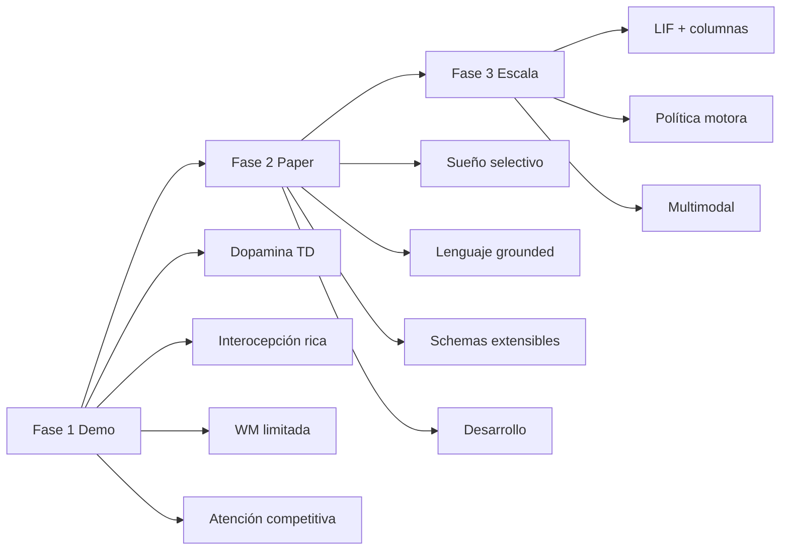

# Roadmap: acercar Nexo a un análogo cerebral más rico

**Estado:** plan de implementación (no ejecutado aún)  
**Fecha:** 2026-07-16  
**Principio:** mejoras verificables en código + métricas; sin afirmar consciencia ni biología completa.

---

## Vista rápida

| Fase | Enfoque | Mejoras | Horizonte | Criterio de “listo” |
|------|---------|---------|-----------|---------------------|
| **1 — Demo** | Comportamiento visible en Flask | #6, #9, #4, #7 | corto | HUD/API muestran señales nuevas; tests unitarios |
| **2 — Paper** | Circuitos medibles + experimentos | #5, #8, #2 (parcial), #1 (parcial) | medio | E4–E6 + tablas CSV |
| **3 — Escala** | Capacidad neuronal / motor | #10, #2 (completo), #3 | largo | perfil >10k + percepción multimodal mínima |

---

## Inventario de las 10 mejoras

| # | Mejora | Fase | Prioridad | Módulos principales |
|---|--------|------|-----------|---------------------|
| 6 | Dopamina predictiva (TD / VTA) | 1 | P0 | `nuclei.py`, `neurotransmitters.py`, `deliberation.py`, `hedonics.py` |
| 9 | Interocepción + neuroendocrino | 1 | P0 | `body.py`, `temporal.py`, `affect.py`, `subcortex.py` |
| 4 | Memoria de trabajo con límite | 1 | P1 | `working_memory.py`, `cortex.py`, `consciousness.py` |
| 7 | Atención top-down vs bottom-up | 1 | P1 | `cognition.py`, `vision.py`, `consciousness.py` |
| 5 | Sueño NREM/REM selectivo | 2 | P0 | `sleep_architecture.py`, `memory_store.py`, `consolidation.py` |
| 8 | Lenguaje grounded (no planificador) | 2 | P0 | `language_network.py`, `embeddings.py`, `encode.py`, `world.py` |
| 2 | Acciones emergentes (parcial→completo) | 2→3 | P1 | `deliberation.py`, `navigation.py`, nuevo `motor_policy.py` |
| 1 | Plasticidad por etapa de vida | 2 | P2 | `lifecycle.py`, `profile.py`, `synapse.py`, `cortex.py` |
| 10 | Escala híbrida LIF + columnas | 3 | P0 | `profile.py`, `cortex.py`, `lobe_cortex.py`, `virtual_assembly.py` |
| 3 | Percepción multimodal | 3 | P1 | `vision.py`, nuevo `audition.py`, `sensory_hub.py` |

---

## Fase 1 — Demo (comportamiento más “vivo”)

**Objetivo:** sin romper E1–E3, enriquecer dinámica homeostática, recompensa y atención visibles en UI.

### 1.1 Dopamina predictiva (#6) — P0

| Campo | Detalle |
|-------|---------|
| **Qué** | Error de predicción \( \delta = r + \gamma V(s') - V(s) \) → libera DA en VTA/accumbens |
| **Cómo** | Tabla o red pequeña de valor por `(room, drive_top, choice_key)`; actualizar tras `world.apply_motor` |
| **Éxito** | `modulators.dopamine` sube tras sorpresa positiva y cae tras expectativa fallida; log en `nuclei` |
| **No hacer** | No dejar que DA elija `choice_key` directamente (sigue deliberación) |

### 1.2 Interocepción rica (#9) — P0

| Campo | Detalle |
|-------|---------|
| **Qué** | Ritmo circadiano de cortisol; fatiga muscular vs sueño; recuperación no lineal |
| **Cómo** | Curva cortisol vs `hour`; `biomech.physical_fatigue` acoplada a `body.fatigue` y sleep |
| **Éxito** | Panel body muestra cortisol diurno; noche ↑ sleep_pressure de forma suave |
| **No hacer** | No afirmar eje HPA biológico |

### 1.3 WM limitada (#4) — P1

| Campo | Detalle |
|-------|---------|
| **Qué** | Capacidad fija (p. ej. 7 slots); overflow → drop LRU o interferencia |
| **Cómo** | `WorkingMemory` con `capacity`; PFC encoding con ruido si overload |
| **Éxito** | Con >7 ítems, `remembered`/agency bajan en tareas duales (test) |
| **No hacer** | No mezclar con SQLite episódico |

### 1.4 Atención competitiva (#7) — P1

| Campo | Detalle |
|-------|---------|
| **Qué** | Presupuesto atencional; bottom-up (dolor, movimiento) vs top-down (goal_stack) |
| **Cómo** | Softmax sobre saliencia; top-down boost si `goal_stack` activo |
| **Éxito** | Dolor alto roba atención a curiosidad; meta PFC puede recuperar foco |
| **Métrica** | `attention_budget_used`, `attended[0].source` ∈ {bottom_up, top_down} |

**Entregables Fase 1**

- [ ] Tests: `tests/test_td_dopamine.py`, `test_wm_capacity.py`, `test_attention_budget.py`
- [ ] API `/api/health` o `/api/state` expone TD error, WM load, attention source
- [ ] UI: 3 señales nuevas en HUD (sin rediseñar layout completo)
- [ ] `CEREBRO_EXPERIMENT_PROFILE` / flags: cambios **off por defecto** en batch paper

---

## Fase 2 — Paper (circuitos medibles)

**Objetivo:** nuevas RQ + experimentos E4–E6 sin invalidar E1–E3.

### 2.1 Sueño selectivo (#5) — P0 → **E4**

| Campo | Detalle |
|-------|---------|
| **Qué** | Priorizar replay emocional; olvido activo de engramas débiles; REM vs NREM distinto |
| **Cómo** | `sample_for_replay` pondera `|valence|` + saliencia consciente; decay de `count` bajo en NREM light |
| **Experimento E4** | sleep_selective vs sleep_uniform vs control → recall de ítems high-emotion vs low |
| **Éxito** | Δ recall emocional > Δ neutro (tabla CSV) |

### 2.2 Lenguaje grounded (#8) — P0 → **E5**

| Campo | Detalle |
|-------|---------|
| **Qué** | Palabras ↔ objetos/habitaciones del mundo (embeddings + tags); LLM sigue post-hoc |
| **Cómo** | Diccionario grounded `label→encode_text` + boost a sensory si objeto visible; `comprehend` mapea a drives, **no** a motor |
| **Experimento E5** | cuidador nombra objeto → ↑ probabilidad de acercarse / interactuar **vía drive/sensory**, midiendo `choice_key` |
| **Éxito** | Con grounding ON, coherencia objeto–acción ↑; con LLM-only (sin grounding) no cambia motor (como E2) |
| **No hacer** | LLM no escribe `choice_key` |

### 2.3 Schemas extensibles (#2 parcial) — P1

| Campo | Detalle |
|-------|---------|
| **Qué** | Registro dinámico de schemas (aprendidos por experiencia), no solo los 15 fijos |
| **Cómo** | `ACTION_SCHEMAS` + `learned_schemas` en persistencia; umbral de consolidación |
| **Éxito** | Tras N éxitos en un patrón motor, aparece schema nuevo en deliberación |
| **Límite Fase 2** | Aún discrete; política continua queda para Fase 3 |

### 2.4 Plasticidad por etapa (#1 parcial) — P2

| Campo | Detalle |
|-------|---------|
| **Qué** | `lifecycle.stage` ∈ {infant, child, adult} → `plasticity_mult`, `prefrontal_inhibition` |
| **Cómo** | `profile.replace(...)` según edad de ticks; poda suave de pesos débiles en “adulto” |
| **Experimento opcional** | misma tarea en infant vs adult → tasa de aprendizaje distinta |

**Entregables Fase 2**

- [x] `experiments/run_e4_sleep_selective.py`, `run_e5_grounding.py`
- [ ] CSV en `experiments/results/` + sección en artefacto/paper
- [x] Ablation flags: `enable_td_reward`, `enable_grounding`, `replay_mode` (selective/uniform)
- [ ] Actualizar `docs/paper/ARTEFACTO_MAESTRO_CLEI_NEXO.md` solo cuando haya resultados reales

---

## Fase 3 — Escala (más cerebro, más coste)

**Objetivo:** más neuronas LIF activas + percepción más rica + motor flexible.

### 3.1 Escala híbrida (#10) — P0

| Campo | Detalle |
|-------|---------|
| **Qué** | Perfil `50k` / `100k` LIF; ensambles virtuales inyectan en **columnas** (`lobe_cortex`), no solo sensory 384-D |
| **Cómo** | Nuevo `SCALE_50K_PROFILE`; governor de descompresión por lóbulo; GPU obligatoria |
| **Éxito** | `profile_neuron_count ≥ 50_000`; tick headless viable en RTX 3050 (o documentar HW mínimo) |
| **Citar** | Separar siempre *active LIF* vs *disk-indexed* |

### 3.2 Política motora (#2 completo) — P1

| Campo | Detalle |
|-------|---------|
| **Qué** | Salida motora continua (velocidad/dirección) entrenada con DA-TD + spikes |
| **Cómo** | Capa ligera sobre `n_motor`; schemas como *priors*, no únicos ganadores |
| **Éxito** | Tarea de navegación nueva sin añadir schema a mano |

### 3.3 Multimodal (#3) — P1

| Campo | Detalle |
|-------|---------|
| **Qué** | Canales visión / audición (eco cuidador) / propiocepción con latencias distintas |
| **Cómo** | `sensory_hub` fusiona con delays; ruido por canal |
| **Éxito** | Ablation de un canal degrada tarea específica (test E7) |

**Entregables Fase 3**

- [x] Perfil documentado en `perfiles_y_experimentos.md` (`SCALE_50K_PROFILE`)
- [x] Benchmark de latencia/tick y memoria GPU (`experiments/bench_tick_gpu.py` → `bench_tick_gpu.csv` + `bench_hw_notes.md`)
- [x] No publicar cifras de “millones activos” si no son LIF
- [x] `brain/motor_policy.py` + `enable_continuous_motor`
- [x] `sensory_hub` delays + E7 `run_e7_multimodal.py`

---

## Orden de implementación sugerido (sprints)

| Sprint | Semanas (est.) | Ítems | Dependencias | Estado |
|--------|----------------|-------|--------------|--------|
| S1 | 1–2 | #6 TD-DA + tests + circadian flag | — | **Hecho** (`brain/td_reward.py`, flag OFF en paper / ON en demo) |
| S2 | 1–2 | #9 circadiano/fatiga + HUD | — | **Hecho** (`circadian_profile`, fatiga/sueño/HUD API) |
| S3 | 1–2 | #4 WM + #7 atención | S1 útil para saliencia | **Hecho** (`working_memory.py`, `attention.py`) |
| S4 | 2–3 | #5 sueño selectivo + E4 | S2 (cortisol/sueño) | **Hecho** (`sleep_architecture` modes + `run_e4_sleep_selective.py`) |
| S5 | 2–3 | #8 grounding + E5 | embeddings / world labels | **Hecho** (`brain/grounding.py`, `run_e5_grounding.py`) |
| S6 | 2 | #2 schemas aprendidos + #1 stages | S1 | **Hecho** (`learned_schemas.py`, lifecycle neuro) |
| S7+ | 4+ | #10 perfil 50k, #2 política, #3 multimodal | GPU, S4–S6 estables | **Hecho (base)** — falta solo re-medir 50k en GPU dedicada si disponible |

*Estimaciones de tiempo no medidas en el repo; ajustar tras S1.*

---

## Guardrails (no romper lo existente)

1. **E1–E3** deben seguir reproducibles con flags OFF / defaults actuales.
2. Nuevas dinámicas detrás de `AblationFlags` o env (`CEREBRO_TD=1`, etc.).
3. Lenguaje: **nunca** `choice_key` desde Ollama.
4. Paper CLEI: no citar mejoras de este roadmap hasta tener CSV.
5. Escala: siempre distinguir neuronas LIF vs virtuales en disco.

---

## Definición de “éxito global” del roadmap

Nexo se parece *más* a un cerebro humano cuando:

1. La recompensa **anticipa** (TD), no solo reacciona.
2. El cuerpo tiene **ritmo** y fatiga acoplada.
3. La atención y la WM son **recursos escasos**.
4. El sueño **elige** qué consolidar.
5. El lenguaje **ancla** al mundo sin decidir el motor.
6. La escala LIF crece **de verdad**, y lo virtual alimenta columnas.

---

## Siguiente acción concreta

**S1 completado** (2026-07-16): `brain/td_reward.py` + flags + demo ON / paper OFF + tests `tests/test_td_reward.py`.

**S2 completado** (2026-07-16): `circadian_profile` en `environment.py`; modula fatiga, presión de sueño, arousal y cortisol objetivo; expuesto en `time_state`, `snapshot` y `/api/health`; tests `tests/test_circadian.py`.

**S3 completado** (2026-07-16): WM limitada + atención competitiva; tests `tests/test_wm_attention.py`.

**S4 completado** (2026-07-16): sueño `default|uniform|selective` + olvido activo; E4 en `experiments/run_e4_sleep_selective.py`; tests `tests/test_selective_sleep.py`.

**S5 completado** (2026-07-16): `brain/grounding.py` (lexicón → drives/sensory, nunca `choice_key`); E5 en `experiments/run_e5_grounding.py`; tests `tests/test_grounding.py`; flag `CEREBRO_GROUNDING` / `enable_grounding`.

**S6 completado** (2026-07-16): `brain/learned_schemas.py` (consolidación tras N éxitos → menú PFC); plasticidad/poda por etapa en `lifecycle.neuro_modulation`; flags `CEREBRO_LEARNED_SCHEMAS` / `CEREBRO_LIFECYCLE_PLASTICITY`; tests `tests/test_learned_schemas.py`.

**S7 parcial** (2026-07-16): `SCALE_50K_PROFILE` (≥50k LIF); `virtual_store.inject_to_lobes`; `motor_policy` continuo; `sensory_hub` con delays/ablation; E7 `run_e7_multimodal.py`; flags `CEREBRO_LOBE_VIRTUAL` / `CEREBRO_CONTINUOUS_MOTOR` / `CEREBRO_MULTIMODAL`.

**S7 bench** (2026-07-16): `python -m experiments.bench_tick_gpu --profiles compact,10k[,50k]` → CSV + notas HW; 50k se omite sin GPU.

**Siguiente:** re-ejecutar E4/E5/E7 en perfil `10k` si se quieren cifras paper-scale; o generar PDF CLEI desde artefacto v1.1.
