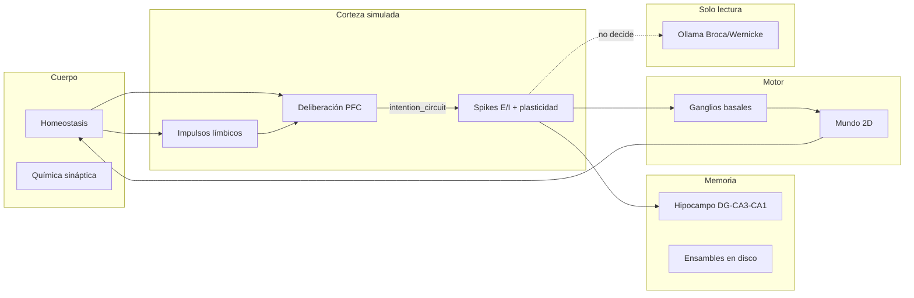

# Nexo: Arquitectura cognitiva neuro-inspirada

Documento formal para el paper workshop/preprint. Nexo es un modelo **mesoescala** parametrizable por perfil (`NeuroProfile`): la conducta emerge de circuitos simulados; el LLM (Ollama) solo verbaliza estado interno.

> **Convención de perfiles:** ver [`perfiles_y_experimentos.md`](perfiles_y_experimentos.md).  
> | Perfil | ~Neuronas activas | Uso |
> |--------|-------------------|-----|
> | `COMPACT_PROFILE` | ~500 | CI, smoke tests, repro rápida (~minutos) |
> | `VIRTUAL_LARGE_PROFILE` | ~1.400 | Demo Flask interactiva (`app.py`, default) |
> | **`SCALE_10K_PROFILE`** | **~10.290** | **Resultados E1–E3 del paper** (`--profile 10k`) |
>
> Las tablas, CSV y figuras en `experiments/results/` corresponden **solo** a `SCALE_10K_PROFILE`. No mezclar cifras de perfiles distintos en el mismo párrafo sin aclarar cuál.

**Causal affordances (Level 2):** ver [`level2_causal_learning.md`](level2_causal_learning.md). `AffordanceMap` / contrafactual / schemas sesgan PFC; solo deliberación escribe `choice_key`.

## Diagrama de flujo

## Ecuaciones neuronales

### LIF (Leaky Integrate-and-Fire)

Cada población cortical e hipocampal usa integración leaky con período refractario (`brain/neuron.py`):

\[
\frac{dv_i}{dt} = \frac{-(v_i - v_{\mathrm{rest}}) + I^{\mathrm{syn}}_i + I^{\mathrm{ext}}_i}{\tau}
\]

Discretizado con \(\Delta t = 1\,\mathrm{ms}\):

\[
v_i \leftarrow v_i + \Delta t \cdot \frac{-(v_i - v_{\mathrm{rest}}) + I^{\mathrm{syn}}_i + I^{\mathrm{ext}}_i}{\tau}
\]

Spike si \(v_i \geq v_{\mathrm{thresh}}\) y no está en refractario; reset a \(v_{\mathrm{reset}}\).

| Población | \(n\) (COMPACT) | \(\tau\) (ms) | \(v_{\mathrm{thresh}}\) (mV) |
|-----------|-----------------|---------------|------------------------------|
| Sensory   | 128             | 14            | −52 (default)                |
| Limbic    | 72              | 18            | −53                          |
| Associative | 112           | 22            | −53                          |
| Prefrontal | 40             | 28            | −51.5                        |
| Motor     | 28              | 15            | −54                          |
| DG / CA3 / CA1 | 40/40/32   | 12–20         | −54 … −52                    |

### Propagación sináptica

Pesos en formato CSR; forward pass:

\[
I^{\mathrm{syn}}_j = \sum_i W_{ji}\, s_i
\]

donde \(s_i \in \{0,1\}\) son spikes presinápticos.

### Plasticidad Hebbiana y STDP

Hebb con trazas exponenciales (`brain/synapse.py`):

\[
\Delta w_{ij} = \eta \left( \mathrm{tr}_i^{\mathrm{pre}} \cdot s_j^{\mathrm{post}} + \mathrm{tr}_j^{\mathrm{post}} \cdot s_i^{\mathrm{pre}} \right)
\]

STDP asimétrico en episodios con `use_stdp=True`:

\[
\Delta w_{ij} = \eta \cdot \mathrm{tr}_i^{\mathrm{pre}} \cdot s_j^{\mathrm{post}} - 0.35\eta \cdot \mathrm{tr}_j^{\mathrm{post}} \cdot s_i^{\mathrm{pre}}
\]

Las trazas decaen: \(\mathrm{tr} \leftarrow \mathrm{tr} \cdot \gamma\) con \(\gamma \approx 0.92\).

### Moduladores

Estado escalar en \([0,1]\): dopamina, serotonina, GABA, acetilcolina, noradrenalina, cortisol. Escalan ganancia sináptica y competencia Go/No-Go en deliberación:

\[
\mathrm{go}_a = \ell_a (0.5 + 0.35\, \mathrm{DA}) + \mathrm{pfc}_a (0.42 + 0.28\, \mathrm{ACh}) + h_a (0.35 + 0.25\, \mathrm{DA})
\]

\[
\mathrm{no\_go}_a = \mathrm{GABA} \cdot \iota_{\mathrm{PFC}} \cdot (0.25 + \mathrm{conflict})
\]

\[
\mathrm{net}_a = \mathrm{go}_a - \mathrm{no\_go}_a + \mathcal{N}(0, \sigma)
\]

## Circuito de intención

1. **Deliberación** (`brain/deliberation.py`): competencia entre urgencia límbica y soporte PFC por esquema de acción.
2. **Priming** (`brain/intention.py`): la decisión se codifica en el vector sensorial y WM prefrontal.
3. **Episodio neural** (`brain/mind.py::_run_episode`): simulación E/I + hipocampo.
4. **Ganglios basales** (`brain/subcortex.py`): gate motor con sesgo de deliberación y veto PFC.
5. **Alineación de spikes** (`record_spike_alignment`): métrica de coherencia decisión→motor.

## Tabla módulo ↔ región cerebral

| Módulo Python | Región / función | Rol en Nexo |
|---------------|------------------|-------------|
| `deliberation.PrefrontalDeliberation` | Corteza prefrontal | Go/No-Go, inhibición de impulsos |
| `cognition.CognitiveCycle` | Red ejecutiva | Atención, predicción, hábitos |
| `intention` | Cápsula PFC→tálamo | Priming sensorial post-decisión |
| `cortex.CorticalNetwork` | Corteza E/I | Sensory, limbic, assoc, PFC, motor |
| `hippocampus_core.HippocampalFormation` | DG–CA3–CA1 | Patrones theta-modulados |
| `regions.Hippocampus` | Hipocampo episódico | Recall / consolidate en disco |
| `virtual_assembly.VirtualAssemblyStore` | Corteza asociativa extendida | Ensambles indexados (~90M virtual) |
| `subcortex.BasalGanglia` | Ganglios basales | Selección acción por spikes |
| `subcortex.Brainstem` | Tronco | Arousal, presión de sueño |
| `subcortex.Cerebellum` | Cerebelo | Suavizado motor |
| `amygdala` / `affect` | Amígdala + química | Valencia, arousal, moduladores |
| `hypothalamus` / `body` | Hipotálamo + cuerpo | Homeostasis, drives |
| `thalamus` | Tálamo | Relay multimodal |
| `lobes` / `lobe_cortex` | Lóbulos | Columnas occipital/temporal/parietal/frontal |
| `language_cortex` | Broca/Wernicke | **Solo verbalización** (Ollama) |
| `world.World2D` | Cuerpo/mundo | Embodiment 2D, recompensas ecológicas |
| `neuroanatomy.BrainAtlas` | Atlas educativo | Mapeo estructura↔actividad |

## Escala y perfiles

| Perfil | Neuronas activas | Uso | ¿Paper E1–E3? |
|--------|------------------|-----|---------------|
| `COMPACT_PROFILE` | ~500 | CI, smoke tests | No |
| `VIRTUAL_LARGE_PROFILE` | ~1.4k + ensambles en disco | Demo interactiva Flask | No |
| **`SCALE_10K_PROFILE`** | **~10.290** | Batch GPU, ablaciones publicadas | **Sí** |

El rango “mesoescala” del proyecto abarca **~500–10k neuronas LIF activas** según perfil; la demo interactiva (~1.4k) y los experimentos del paper (10k) son **configuraciones distintas** del mismo código.

## Hipótesis experimentales (E1–E3)

| ID | Manipulación | Predicción |
|----|--------------|------------|
| E1 NoBind | `bind_deliberation=False` | ↓ spike alignment, ↓ coherencia con drives |
| E1 NoPFC | ganador límbico forzado | ↓ agency, ↓ tasa inhibición PFC |
| E1 NoHippo | sin recall/consolidate | ↓ remembered |
| E1 NoAffect | sin `affect.process_stimulus` | ↓ variación conductual bajo estrés |
| E2 LLM on/off | `CEREBRO_OLLAMA` | Trayectorias motoras y deliberación **idénticas** |
| E3 Sleep | `sleep()` tras aprendizaje | ↑ recall vs control sin sueño |

## Referencias de implementación

- Deliberación: `brain/deliberation.py`
- Episodio: `brain/mind.py::_run_episode`, `world_tick`
- Plasticidad: `brain/synapse.py`, `brain/cortex.py::tick`
- Consolidación: `brain/mind.py::sleep`, `brain/consolidation.py`
- Tests de intención: `tests/test_intention_circuit.py`
