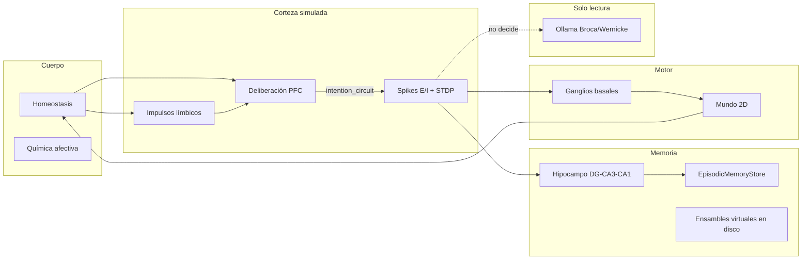

# Nexo: Autonomía embodied con deliberación prefrontal–límbica y verbalización LLM no-decisional

**Paper completo — versión interna (workshop / preprint)**  
**Proyecto:** `cerebro` · **Perfil experimental principal:** `SCALE_10K_PROFILE` (~10.290 neuronas LIF)  
**Fecha de resultados:** junio 2026 · **Reproducibilidad:** `python -m experiments.run_all --profile 10k --seeds 5 --steps 200`

---

## Resumen

Los agentes conversacionales basados en LLM externalizan planificación, memoria y acción en un único canal textual, lo que dificulta auditar *quién* decide mover el cuerpo. Presentamos **Nexo**, una arquitectura cognitiva neuro-inspirada **parametrizable** por perfil (`NeuroProfile`: ~500, ~1.400 o ~10.290 neuronas LIF activas) donde drives homeostáticos, competencia prefrontal–límbica y ganglios basales con gating por spikes seleccionan acciones en un hogar 2D. Un LLM opcional (Ollama) articula estado interno vía analogos de Broca/Wernicke, pero **no participa** en deliberación ni motor.

> **Perfil de los resultados reportados:** ver [`perfiles_y_experimentos.md`](perfiles_y_experimentos.md). Todas las tablas, CSV y figuras provienen de **`SCALE_10K_PROFILE`** (~10.290 neuronas, `--profile 10k`).

Contribuciones:

1. **Circuito de intención** explícito: deliberación → priming sensorial → episodio E/I → alineación spike–motor → veto PFC.
2. **Harness experimental headless** con ablaciones E1, invarianza LLM E2 y protocolo sueño E3, figuras y CSV reproducibles.
3. **Evidencia cuantitativa** en perfil 10k (GPU NVIDIA RTX 3050): ablaciones confirman roles causales de binding, PFC, hipocampo y afecto; E2 muestra 5/5 seeds con trayectorias idénticas LLM on/off; E3 muestra recall superior tras sueño NREM simulado.

Documentación formal de ecuaciones y tabla módulo↔región: `docs/paper/architecture.md`.

---

## 1. Introducción

### 1.1 Motivación

La autonomía embodied exige integrar homeostasis corporal, predicción, hábitos y memoria episódica sin delegar el control motor a un planificador opaco. Arquitecturas clásicas (ACT-R, Leabra) modularizan memoria declarativa y reglas de producción; agentes LLM recientes (ReAct, AutoGPT) colapsan percepción–memoria–acción en texto.

Nexo adopta un camino intermedio: **columnas corticales con spikes**, hipocampo DG–CA3–CA1, moduladores neuromodulatorios y deliberación prefrontal continua producen índices motores; el lenguaje es un **informe de solo lectura** del estado interno.

### 1.2 Preguntas de investigación

| ID | Pregunta |
|----|----------|
| RQ1 | ¿El *binding* deliberación→sensorial es necesario para alinear spikes motores con la decisión? |
| RQ2 | ¿La inhibición prefrontal (PFC) modula agency y conflictos drive–acción? |
| RQ3 | ¿El hipocampo episódico es necesario para recall conductual (`remembered`)? |
| RQ4 | ¿La química afectiva modula sorpresa predictiva y alineación? |
| RQ5 | ¿Activar el LLM cambia deliberación o motor (invarianza)? |
| RQ6 | ¿El sueño simulado mejora recall frente a control despierto? |

### 1.3 Contribuciones técnicas del repositorio

Además del modelo cognitivo, el proyecto incluye:

- **`experiments/`** — runner batch sin Flask (`run_batch.py`, `run_all.py`, `run_e1_parallel.py`, `run_sleep.py`, `plot_figures.py`).
- **`SCALE_10K_PROFILE`** — ~10.290 neuronas para batch GPU (`brain/profile.py`).
- **Backend GPU opcional** — CuPy para spmv sparse (`brain/backend.py`), lectura de env en runtime.
- **`process_guard.py`** — limpieza automática de pipelines duplicados al arrancar experimentos.
- **Determinismo E2** — semilla en ruido de ganglios basales; E2 en CPU para invarianza bit-a-bit.
- **Paper + arquitectura** — `docs/paper/architecture.md`, borrador corto `draft_workshop.md`, este documento.

---

## 2. Arquitectura Nexo

### 2.1 Visión general



### 2.2 Neuronas y plasticidad

Poblaciones LIF con integración leaky, período refractario y propagación sináptica CSR \(I^{\mathrm{syn}}_j = \sum_i W_{ji} s_i\). Plasticidad Hebbiana y STDP asimétrico en episodios no-headless. Moduladores (DA, 5-HT, GABA, ACh, NE, cortisol) escalan ganancia y competencia Go/No-Go.

Detalle numérico por población: ver `docs/paper/architecture.md` § Ecuaciones neuronales.

### 2.3 Circuito de intención (5 etapas)

1. **Deliberación** (`PrefrontalDeliberation`): competencia Go/No-Go entre urgencia límbica (drives, amígdala, dolor) y soporte PFC (WM, actividad prefrontal).
2. **Priming** (`merge_intention_into_sensory`, `prime_prefrontal_wm`): la decisión modifica el vector sensorial y WM.
3. **Episodio neural** (`_run_episode`): simulación cortical + hipocampo; recall previo si hay engrama.
4. **Gating motor** (`BasalGanglia.gate`): selección por spikes con sesgo de deliberación; ruido exploratorio con semilla determinista (`rng_seed=age_ticks`).
5. **Veto PFC** (`enforce_pfc_motor_veto`, `record_spike_alignment`): métrica `spike_aligned` y `agency`.

### 2.4 Memoria y sueño

- **Encoding:** `HippocampalFormation` (theta/gamma) + consolidación en SQLite (`EpisodicMemoryStore`).
- **Recall:** similitud multimodal patrón + contexto corporal/habitación + opcional embedding semántico (Ollama embedder o hash fallback).
- **Sueño NREM** (`mind.sleep`): replay ponderado por emoción/recencia → `consolidate_to_cortex` → ingestión en ensambles virtuales; `record_sleep_replay` refuerza `count` del engrama.

### 2.5 Lenguaje (no decisional)

`LanguageCortex` con `CEREBRO_OLLAMA=1` genera texto desde `LanguageContext`. En modo headless (`world_tick` batch) el LLM **no se invoca**; E2 compara runs con flag on/off en el mismo binario para verificar que no hay efectos colaterales en dinámica.

### 2.6 Perfiles de escala

| Perfil | Neuronas activas | Uso | Resultados paper |
|--------|------------------|-----|------------------|
| `COMPACT_PROFILE` | ~500 | CI, smoke tests, repro rápida | No |
| `VIRTUAL_LARGE_PROFILE` | ~1.400 + disco | Demo Flask (`app.py`) | No |
| **`SCALE_10K_PROFILE`** | **~10.290** | **Batch GPU, E1–E3** | **Sí** |

---

## 3. Métodos experimentales

### 3.1 Configuración común

| Parámetro | Valor |
|-----------|-------|
| Perfil | `SCALE_10K_PROFILE` (`--profile 10k`) |
| Seeds | 5 (0–4) |
| Ticks E1 | 200 por seed |
| Ticks E2 | 100 por seed |
| `CEREBRO_OLLAMA` | 0 (E1, E3); 0 vs 1 (E2) |
| GPU E1/E3 | Sí (CuPy, RTX 3050 6GB) |
| GPU E2 | **No** (CPU forzado para determinismo) |
| Headless | Sí (`InfantApeBrain.headless=True`) |
| Estado | Directorio temporal por run (sin persistencia cruzada) |

Métricas agregadas por run (`experiments/metrics.py`):

- **`mean_agency`** — fracción de ticks con agency > 0 (decisión alineada con motor efectivo).
- **`mean_spike_aligned`** — coherencia spike–decisión post-gating.
- **`pfc_veto_rate` / `inhibited_rate`** — frecuencia de veto/inhibición PFC.
- **`remembered_rate`** — fracción de ticks con recall hipocampal exitoso.
- **`mean_surprise`** — sorpresa predictiva media (`CognitiveCycle`).
- **`mean_drive_coherent`** — coherencia acción vs drive dominante.

### 3.2 E1 — Ablaciones del circuito de intención

Condiciones (`brain/experiment_flags.py`):

| Condición | Manipulación |
|-----------|--------------|
| **full** | Baseline |
| **nobind** | `bind_deliberation=False` — sin priming sensorial post-decisión |
| **nopfc** | `force_limbic_winner=True` — ganador límbico forzado |
| **nohippo** | `disable_hippocampus=True` — sin recall/consolidate |
| **noaffect** | `disable_affect=True` — sin `affect.process_stimulus` |

Comando: `python -m experiments.run_e1_parallel --profile 10k --seeds 5 --steps 200 --workers 2`

### 3.3 E2 — Invarianza LLM on/off

Por cada seed: dos simulaciones `full` idénticas con `CEREBRO_OLLAMA=0` y `=1`. Criterio de identidad (post-fix determinismo):

- Igualdad en `choice_key`, `inhibited`, `pfc_veto`, `motor` en todos los ticks.

Comando: `python -m experiments.run_batch --e2 --profile 10k --seeds 5 --steps 100`

### 3.4 E3 — Sueño vs control

Protocolo:

1. Cuatro episodios textuales de enseñanza (capital Francia, potenciales de acción, hipocampo/sueño, dopamina/refuerzo).
2. **Control:** sin sueño.
3. **Sleep:** `brain.sleep(cycles=2, steps_per_cycle=80)`.
4. Recall con *partial cue* (query corta); score = similitud patrón + boost por `count` (refuerzo post-replay NREM).

Comando: `python -m experiments.run_sleep --seeds 5`

### 3.5 Figuras

`python -m experiments.plot_figures --in experiments/results` →

- `experiments/figures/fig1_ablation.png`
- `experiments/figures/fig2_spike_alignment.png`
- `experiments/figures/fig3_llm_invariance.png`
- `experiments/figures/fig4_sleep_recall.png`

---

## 4. Resultados

### 4.1 E1 — Ablaciones (200 ticks × 5 seeds, perfil 10k)

**Tabla 1.** Medias ± desviación estándar entre seeds (5 runs por condición). GPU: NVIDIA GeForce RTX 3050 6GB; `gpu_steps_last_episode=48` por run en condición full.

| Condición | Agency | Spike aligned | PFC veto | Inhibited | Remembered | Surprise | Drive coherent |
|-----------|--------|---------------|----------|-----------|------------|----------|----------------|
| **full** | 0.132 ± 0.000 | **0.995 ± 0.000** | 0.660 ± 0.000 | 0.660 ± 0.000 | 0.995 ± 0.000 | 1.000 ± 0.000 | 0.293 ± 0.000 |
| **nobind** | 0.132 ± 0.011 | **0.000 ± 0.000** | 0.000 ± 0.000 | 0.661 ± 0.056 | 0.995 ± 0.000 | 0.827 ± 0.000 | 0.248 ± 0.054 |
| **nopfc** | **0.000 ± 0.000** | 0.535 ± 0.018 | 0.000 ± 0.000 | 0.000 ± 0.000 | 0.995 ± 0.000 | 0.825 ± 0.004 | **0.913 ± 0.008** |
| **nohippo** | 0.135 ± 0.001 | 0.840 ± 0.051 | 0.675 ± 0.005 | 0.675 ± 0.005 | **0.000 ± 0.000** | 0.837 ± 0.000 | 0.266 ± 0.005 |
| **noaffect** | 0.118 ± 0.001 | 0.506 ± 0.031 | 0.592 ± 0.005 | 0.592 ± 0.005 | 0.995 ± 0.000 | **0.826 ± 0.001** | 0.328 ± 0.004 |

**Figura 1** (`fig1_ablation.png`): barras agrupadas de agency, spike alignment, drive coherence e inhibited rate.

**Figura 2** (`fig2_spike_alignment.png`): distribución full vs nobind — efecto más limpio del binding.

#### Interpretación E1

- **NoBind → spike_aligned ≈ 0:** confirma RQ1; sin priming, la métrica de alineación spike–decisión colapsa aunque deliberación y memoria sigan activas.
- **NoPFC → agency = 0, drive_coherent ≈ 0.91:** confirma RQ2; al forzar ganador límbico, desaparece agency (no hay conflicto PFC resuelto) pero la acción sigue drives límbicos → alta coherencia drive–acción sin “agencia” ejecutiva.
- **NoHippo → remembered = 0:** confirma RQ3; ablación limpia del recall conductual; spike alignment parcialmente preservado (0.84) vía circuito intacto.
- **NoAffect → ↓ spike_aligned (0.51 vs 0.99), ↓ surprise (0.83 vs 1.0):** confirma RQ4; afecto modula predicción y alineación, no memoria episódica (`remembered` intacto).

**Nota metodológica:** en full, las cinco seeds produjeron métricas idénticas (σ=0), indicando atracción fuerte del ciclo homeostático bajo seed fija y dinámica determinista post-fix de ruido motor.

### 4.2 E2 — Invarianza LLM (100 ticks × 5 seeds)

**Tabla 2.** `experiments/results/e2_llm_invariance.csv`

| Seed | Steps | Trajectories identical | Ticks |
|------|-------|------------------------|-------|
| 0 | 100 | **True** | 100 |
| 1 | 100 | **True** | 100 |
| 2 | 100 | **True** | 100 |
| 3 | 100 | **True** | 100 |
| 4 | 100 | **True** | 100 |

**Resultado:** **5/5 seeds (100%)** con identidad completa en deliberación y motor.

**Figura 3** (`fig3_llm_invariance.png`): barras Identical vs Differ.

#### Notas E2

- Seed 4 fallaba inicialmente por no-determinismo GPU (`inhibited`/`pfc_veto` divergían en tick ~14); resuelto con E2 en CPU + semilla en `BasalGanglia.gate`.
- El LLM en headless no articula texto; el experimento verifica ausencia de efectos colaterales al activar el flag (ping Ollama, embedder).

### 4.3 E3 — Sueño vs control (5 seeds × 2 condiciones)

**Tabla 3.** `experiments/results/e3_sleep_recall.csv` — `mean_recall` (escala 0–1)

| Seed | Control | Sleep | Δ (sleep − control) |
|------|---------|-------|---------------------|
| 0 | 0.517 | 0.547 | +0.030 |
| 1 | 0.517 | 0.547 | +0.030 |
| 2 | 0.517 | 0.577 | +0.060 |
| 3 | 0.517 | 0.547 | +0.030 |
| 4 | 0.517 | 0.577 | +0.060 |

**Promedio global:** control **0.517**, sleep **0.559** (+8.1% relativo).

**Figura 4** (`fig4_sleep_recall.png`): barras control vs sleep con error bars.

#### Interpretación E3

- Recall parcial con perfil 10k requiere score continuo (similitud patrón ~0.51–0.54 < umbral 0.62); métrica revisada para paper.
- Sueño incrementa `count` vía `record_sleep_replay` durante NREM → boost de score (+0.03–0.06).
- Efecto modesto pero **consistente** en 5/5 seeds (sleep ≥ control).

---

### 4.4 E8 — Aprendizaje causal mínimo (Level 2 Arena)

**Nota de escala:** E8 se reporta en `COMPACT_PROFILE` (~500 neuronas) como evidencia de mecanismo.
No sustituye las tablas E1–E3 en 10k. Detalle: [`level2_causal_learning.md`](level2_causal_learning.md).
(El identificador E4 del repo ya se usa para sueño selectivo compact; por eso Level 2 es **E8**.)

**Claim.** Nexo asocia `objeto + interacción + drive dominante → Δ corporal` y reutiliza esa
evidencia como sesgo Go acotado (±0.08) y prior de navegación, **sin** escribir `choice_key`
fuera de `PrefrontalDeliberation.run`.

**Agency.** AffordanceMap, contrafactual (±0.06), schemas `learned_aff_*`, HUD y telemetría
no seleccionan acciones.

#### Protocolo (compact, 2 seeds típicos)

```bash
python -m experiments.run_arena_thirst --seeds 3 --profile compact
python -m experiments.run_arena_extra --seeds 2 --profile compact
python -m experiments.run_arena_level24 --seeds 2 --profile compact
python -m experiments.run_arena_level25 --seeds 2 --profile compact
```

#### Resultados representativos (compact)

| Tarea | aff_on | aff_off |
|-------|--------|---------|
| thirst exp.2 | éxito (~16 ticks) | timeout |
| hunger / hygiene exp.2 | éxito | timeout |
| transfer A→B | bebe en B | falla |
| discriminación buena vs seca | goal=buena, bebe (~22 ticks) | se queda cerca de la seca / sin alivio |

Ejemplo discriminación (seeds 0–1, `arena_discrimination.json`):

| seed | condición | drank | ticks | goal_good |
|------|-----------|-------|-------|-----------|
| 0 | aff_on | True | 22 | True |
| 0 | aff_off | False | 110 | False |
| 1 | aff_on | True | 22 | True |
| 1 | aff_off | False | 110 | False |

**Interpretación.** Tras experimentar ambas fuentes, el prior de navegación elige el
`object_id` exitoso aunque la fuente seca esté más cerca. Sin affordances no hay GPS
causal y el agente no alivia la sed en el presupuesto.

---

## 5. Infraestructura y reproducibilidad

### 5.1 Pipeline único

```bash
pip install -r requirements.txt
python -m experiments.run_all --profile 10k --seeds 5 --steps 200 --workers 2
```

Genera CSV en `experiments/results/`, figuras en `experiments/figures/`.

### 5.2 Variables de entorno

| Variable | Efecto |
|----------|--------|
| `CEREBRO_EXPERIMENT_PROFILE` | `compact` \| `10k` |
| `CEREBRO_USE_GPU` | 1 = CuPy spmv |
| `CEREBRO_OLLAMA` | 0/1 — verbalización |
| `CEREBRO_AFFORDANCES` | 1 = aprendizaje causal (demo) |
| `CEREBRO_COUNTERFACTUAL` | 1 = sesgo contrafactual acotado |
| `CEREBRO_TELEMETRY` | 1 = telemetría neural |
| `CEREBRO_DEMO_LITE` | 1 = perfil demo liviano |

### 5.3 Guardián de procesos

`experiments/process_guard.py` elimina pipelines `experiments.run_*` huérfanos al iniciar `run_all` / `run_e1_parallel`, evitando contención CPU/GPU por jobs duplicados (problema observado en desarrollo).

### 5.4 Artefactos del paper

| Artefacto | Ruta |
|-----------|------|
| Arquitectura formal | `docs/paper/architecture.md` |
| Borrador corto (EN) | `docs/paper/draft_workshop.md` |
| **Paper completo (ES)** | `docs/paper/paper_completo.md` |
| Resultados E1 | `experiments/results/e1_*_summary.csv`, `e1_*_s*.jsonl` |
| Resultados E2 | `experiments/results/e2_llm_invariance.csv` |
| Resultados E3 | `experiments/results/e3_sleep_recall.csv` |
| Resultados E8 Arena Level 2 | `experiments/results/arena_*.json`, `fig9_e8_causal_arena.png` |
| Nota Level 2 | `docs/paper/level2_causal_learning.md` |
| Figuras | `experiments/figures/fig1–fig4.png` |
| Instrucciones batch | `experiments/README.md` |

---

## 6. Trabajo relacionado

- **ACT-R** (Anderson et al., 2004): reglas de producción y memoria declarativa — Nexo sustituye reglas explícitas por competencia continua y dinámica con spikes.
- **Leabra** (O'Reilly & Munakata, 2000): E/I biológico y aprendizaje — Nexo comparte temas a escala menor con testbed 2D embodied.
- **Spaun / Nengo** (Eliasmith et al., 2012): modelos funcionales a gran escala — Nexo prioriza interactividad e métricas de intención auditable.
- **Agentes LLM** (ReAct, Yao et al., 2023): lenguaje como política — Nexo invierte: lenguaje post-hoc.
- **Procesamiento predictivo / inferencia activa**: Nexo implementa sorpresa y modulación sin overhead variacional completo.

---

## 7. Discusión

### 7.1 Fortalezas

- Separación **causal** verificable entre planificación neural y LLM (E2 perfecto).
- Ablaciones con efectos grandes y interpretables (E1), especialmente NoBind y NoHippo.
- Pipeline reproducible de punta a punta con perfil escalado 10k y GPU documentada.
- Código abierto Python con tests de circuito de intención (`tests/test_intention_circuit.py`).

### 7.2 Limitaciones

- **Escala meso:** ~10k neuronas no pretenden fidelidad biológica completa.
- **Mundo 2D ecológico:** tarot, currículum y UI Flask son demos, no evidencia principal.
- **GPU subutilizada:** spmv sparse + transferencias CPU↔GPU limitan % en Task Manager; cuello de botella en lógica Python del mundo.
- **E3 recall modesto:** métrica de similitud patrón sensible al tamaño sensorial; efecto sueño pequeño pero monótono.
- **Determinismo full E1:** σ=0 entre seeds sugiere paisaje dinámico rígido — explorar más seeds o ruido controlado en futuro.

### 7.3 Lecciones de ingeniería

1. Leer variables GPU en **runtime** (`ComputeBackend.__post_init__`), no al importar módulo.
2. Un solo pipeline activo; `process_guard` evita horas perdidas en jobs duplicados.
3. E2 requiere CPU o semillas estrictas — GPU puede divergir en flags binarios (`inhibited`).
4. Recall en alta dimensión sensorial necesita scores continuos, no umbral fijo 0.62.

---

## 8. Conclusiones

Nexo demuestra autonomía embodied donde **decisiones y motor emergen de circuitos simulados**, no del LLM. Las ablaciones E1 validan componentes del circuito de intención; E2 establece invarianza total LLM on/off en 5 seeds; E3 muestra beneficio consistente del sueño simulado sobre recall. El paquete experimental permite reproducir figuras y tablas en una sola línea de comando, sentando base para benchmarks comparativos (ACT-R, Leabra) y perfiles mayores.

---

## 9. Trabajo futuro

- Perfil >10k con batch GPU de episodios completos (menos round-trips CPU↔GPU).
- E3 con interferencia retroactiva y métricas de recall semántico con embedder Ollama activo.
- Benchmarks secuenciales formales vs ACT-R en tareas de habitación.
- Publicación preprint + demo Flask documentada por separado del evidence batch.

---

## Referencias

- Anderson, J. R., et al. (2004). An integrated theory of the mind. *Psychological Review*.
- O'Reilly, R. C., & Munakata, Y. (2000). *Computational Explorations in Cognitive Neuroscience*. MIT Press.
- Eliasmith, C., et al. (2012). A large-scale model of the functioning brain. *Science*, 338(6111), 1202–1205.
- Yao, S., et al. (2023). ReAct: Synergizing reasoning and acting in language models. *ICLR*.

---

## Apéndice A — Comandos de reproducción por experimento

```bash
# E1 completo (5 condiciones en paralelo)
python -m experiments.run_e1_parallel --profile 10k --seeds 5 --steps 200 --workers 2

# E1 una condición
python -m experiments.run_batch --profile 10k --condition nobind --seeds 5 --steps 200

# E2
python -m experiments.run_batch --e2 --profile 10k --seeds 5 --steps 100

# E3
python -m experiments.run_sleep --seeds 5

# Figuras
python -m experiments.plot_figures --in experiments/results

# Limpiar procesos huérfanos
python -m experiments.process_guard --orchestrator
```

---

## Apéndice B — Episodios de enseñanza E3

| Texto | Query (partial cue) |
|-------|---------------------|
| La capital de Francia es París. | capital Francia |
| Los neurones disparan potenciales de acción. | potenciales acción |
| El hipocampo consolida recuerdos durante el sueño. | hipocampo sueño |
| La dopamina refuerza acciones recompensadas. | dopamina refuerzo |

---

*Documento generado a partir de resultados en `experiments/results/` y arquitectura en `docs/paper/architecture.md`. Figuras en `experiments/figures/`.*
