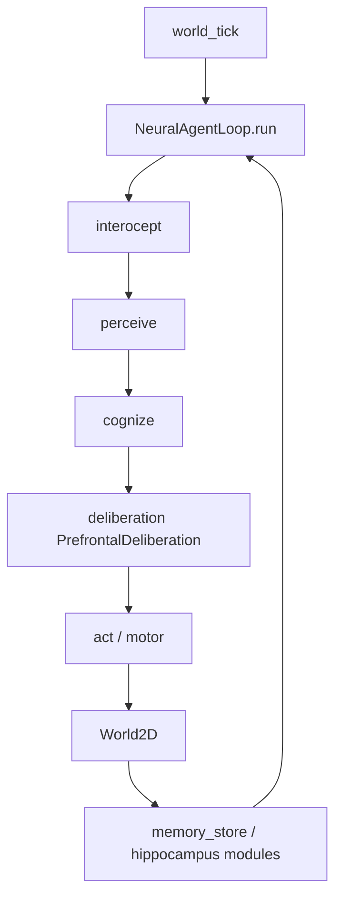
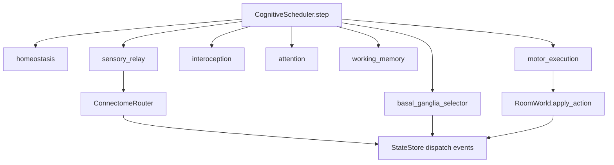

# Flujo de datos actual — NEXO

**Actualizado:** 2026-08-04 (rama `feature/nexo-integrated-brain-v1`)

## Legacy (InfantApeBrain)

**Estado:** disperso en atributos de `InfantApeBrain` (100+ campos).

**Aleatoriedad:** `nexo.random_streams.RandomStreams` inyectado en `mind.py`; residuo en algunos módulos.

## Integrado v1 (Sprint 1)

**Estado:** `StateStore` con reducers; event log con trazabilidad causal.

**Interfaz pública:** `IntegratedRuntime.run()`; compatible con `nexo.run` CLI.

## Puntos de convergencia planificados

| Legacy | Integrado v1 |
|--------|--------------|
| `brain/deliberation.py` | `nexo/prefrontal/` (Sprint 5) |
| `brain/memory_store.py` | `nexo/memory/hippocampus/` (Sprint 4) |
| `brain/agent_loop.py` | `nexo/core/scheduler.py` |
| `brain/body.py` | `nexo/body/` (Sprint 2) |
